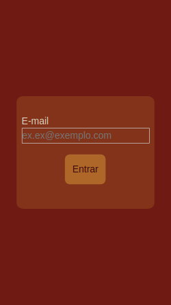
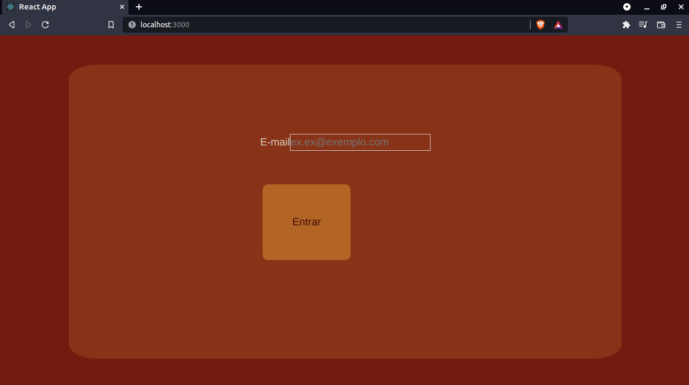
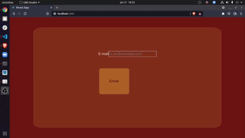
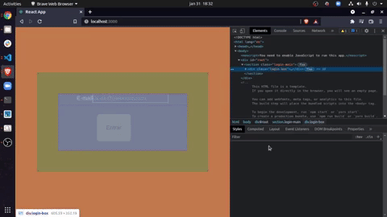
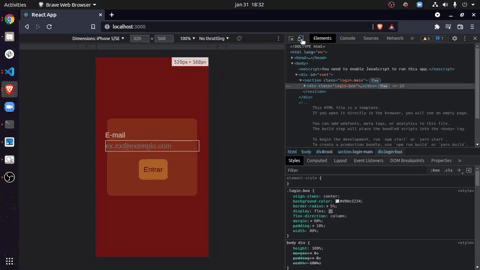
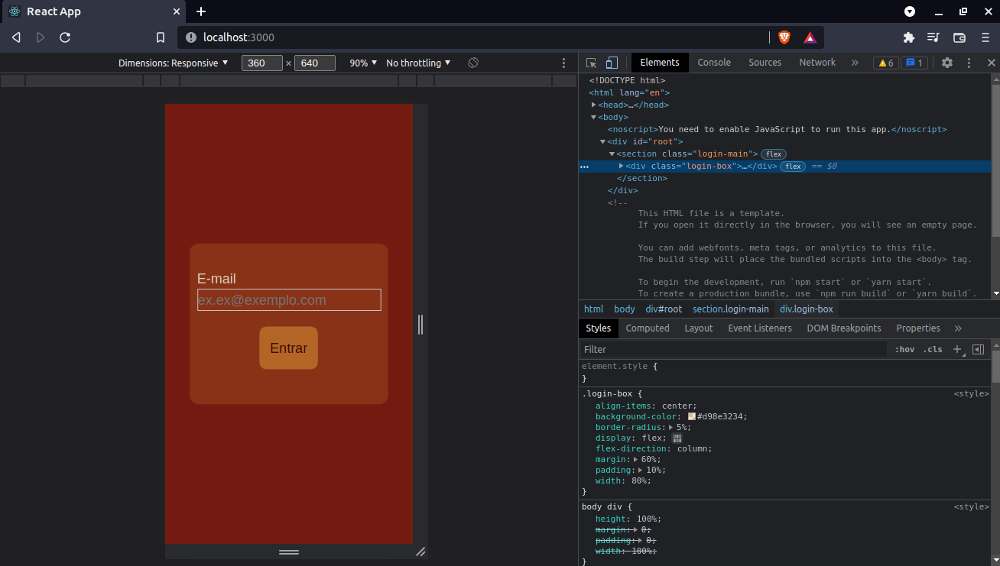

# Boas vindas ao repositório do projeto Recipes App

Esse projeto foi desenvolvido para por em prática os meus conhecimentos:

## Hard Skills

- React
- States
- Props
- Hooks
- Interações com APIs
- Bibliotecas de armazenamento, neste caso em específico `Context-API`

## Soft Skills

- Escuta ativa
- Liderança
- Empatia
- Comunicação
- Colaboração

Esta aplicação foi desenvolvida em grupo e é capaz de exibir receitas de comidas e bebidas, essas receitas podem ser filtradas por nome, ingredientes e locais de onde são originárias.

---

<!-- ## Preview do projeto

 -->

---

## Instalação do projeto localmente

Após cada um dos passos, haverá um exemplo do comando a ser digitado para fazer o que está sendo pedido, caso tenha dificuldades e o exemplo não seja suficiente, não hesite em me contatar em *iago.pferreiravr@gmail.com*.

Passo 1. Abra o terminal e crie um duretório no local de sua preferência com o comando `mkdir`:

~~~bash
mkdir projetos-iago
~~~

Passo 2. Entre no diretório que você acabou de criar:

~~~bash
cd projetos-iago
~~~

Passo 3. Clone o projeto:

~~~bash
git clone git@github.com:IagoPFerreira/recipes-app.git
~~~

Passo 4. Após terminado a clonagem, entre no diretório que você acabou de clonar:

~~~bash
cd recipes-app
~~~

Passo 5. Instale todas as dependências do projeto:

~~~bash
npm install
~~~

Passo 6. Após a instalação das dependências, rode a aplicação

~~~bash
npm start
~~~

A aplicação será aberta no seu navegador automaticamente, e ela deve se parecer com essa:

---

## Ponto imporante

Esta aplicação foi desenvolvida com a intenção de ser uma aplicação mobile, ou seja, ela foi totalmente estruturada para funcionar em dispositivos mobile, por mais que haja uma estilização para atender dispositivos não mobile, esta aplicação tem uma melhor harmonia estética e funcional em telas de resolução `360px X 640px`

### Mudando a resolução do seu navegador

De inicio o seu navegador deve se parecer com esse:

Passo 1. Aperte a tecla `F12` do seu teclado ou clique com o `botão direito` na tela e clique em `inspecionar`, a sua tela deve se parecer com essa:

Passo 2. Nesta nova sessão aberta no seu navegador, no topo estará um menu com alguns campos, ao lado esquerdo de onde estiver escrito `Elements` ou `Elementos`, haverá um o botão clique nele e sua tela deverá se parecer com essa:

Passo 3. Mude as dimensões da tela, nessa nova aba aberta mude no menu `Dimensions` ou `Dimensões` para `Responsive` ou `Responsivo`, após isso no primeiro campo digite `360` e no segundo campo digite `640`

Passo 4. Clique em qualquer lugar da aplicação e as alterações nas dimensões serão feitas, e sua aplicação deverá se parecer com essa:

---

## Link para o deploy

Você também pode acessar essa aplicação diretamente da web, sem precisar instalar nada:

<https://recipes-app-fe.herokuapp.com/>

## Link para o portfolio

Você pode ir ao meu portfolio e conferir os outros projetos que eu já desenvolvi

<https://iagopferreira.github.io/portfolio-react>
